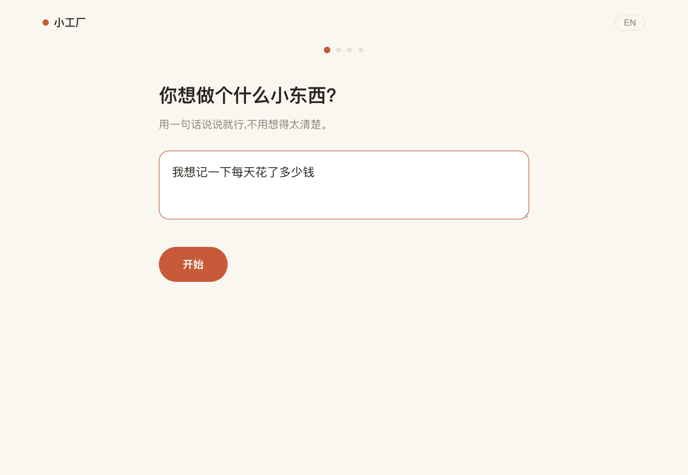
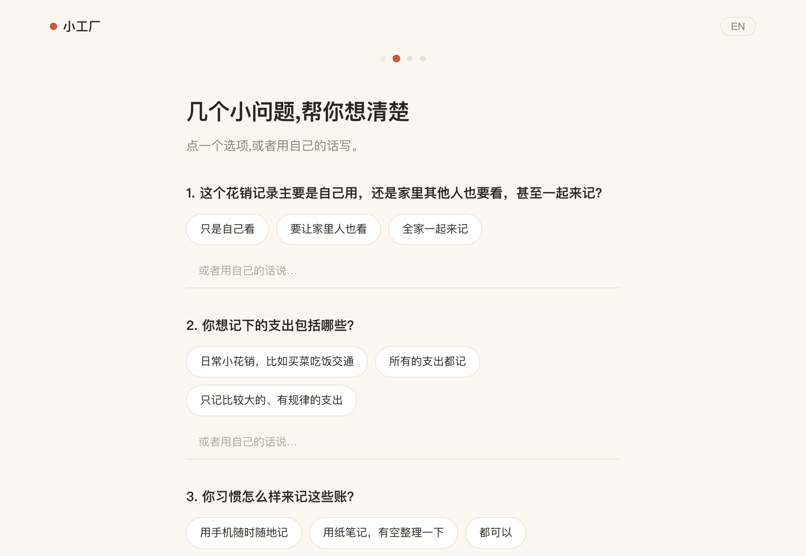
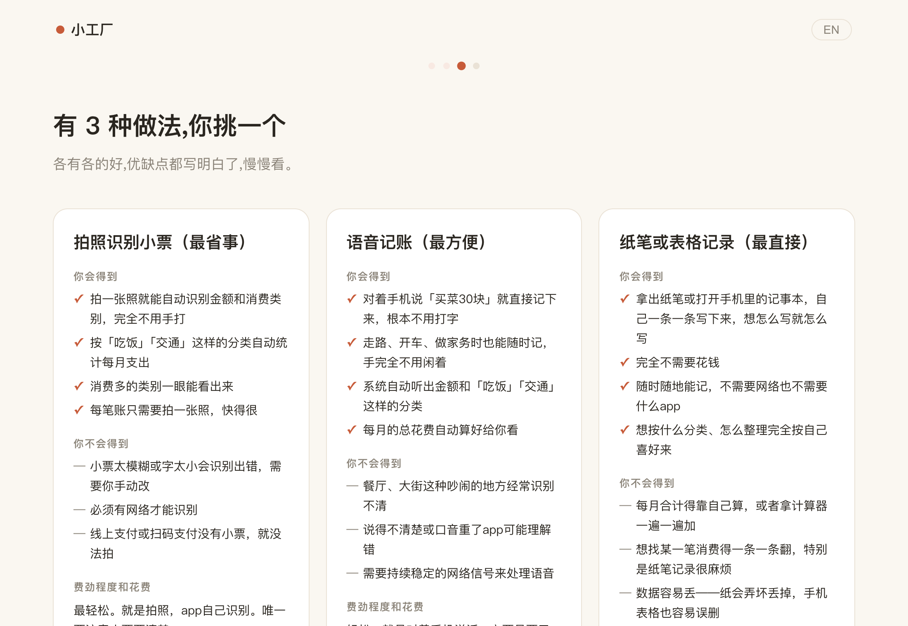

# demo-factory 小工厂

[](https://github.com/CTlanston/demo-factory/actions/workflows/ci.yml)

**把一句模糊的想法,变成一个能点的小东西——给一辈子不会写 prompt 的人。**
Turn one vague sentence into a clickable little tool — for people who will never write a prompt.

```
"我想记一下每天花了多少钱"
        ↓  几个像邻居聊天一样的问题(零术语)
        ↓  3 个实质不同的做法,优缺点用大白话写明白
        ↓  一个单文件 demo.html —— 双击就能用,代码归你
```

## 这是什么 / What this is

AI 已经能把清楚的需求变成能跑的软件。真正的瓶颈在前面一步:**大多数人说不清楚自己要什么,也不知道有哪些选择。**

demo-factory 是一层"把话问清楚"的向导(clarification layer),不是又一个 build engine:

- **访谈**:5-8 个生活化问题(给谁用?最想一眼看到什么?)——代码里强制执行零术语黑名单。
- **选项**:恰好 3 条实质不同的路线,每条都诚实写出"你不会得到什么"。这是本产品的核心时刻。
- **交付**:调用现成引擎(Claude CLI)生成**单文件 demo.html**——离线可用、双击即开、数据存在本机、代码完全归你。

构建引擎是骑现成的(`claude -p`),我们一行编排平台都没写。三个模块、零运行时依赖、一个进程。

## 走一遍 / A real walkthrough

下面 4 张图来自一次真实运行(persona:记账,内容未经修改;完整产物在 [examples/01](examples/01-daily-expenses-记账/)):

| 1 · 一句话想法 | 2 · 无术语访谈 |
|---|---|
|  |  |
| **3 · 三个诚实的选项** | **4 · 交付,代码归你** |
|  |  |

## 快速开始 / Quickstart

见 [QUICKSTART.md](QUICKSTART.md) —— 安装到第一个 demo 约 5 分钟动手时间。
需要:Node ≥20 + 已登录的 [Claude CLI](https://claude.com/claude-code)。每个 demo 的真实成本约 **$0.4-0.7**(访谈/选项用轻量模型,demo 由完整模型构建;遇到重试会更高,实测最高 $1.02),用时 **3-7 分钟**。

## 真的能用吗 / Does it actually work?

不吹参数,只给收据(全部在 [EVIDENCE.md](EVIDENCE.md)):

- **100 次真实端到端测试,98 次全绿**:20 个虚拟小白 persona × 5 个随机种子,走真实 HTTP + 真实模型,5 项程序化判据(零术语访谈 / 3 个实质不同选项 / demo 单文件 + 无控制台报错 + 包含用户要的功能 / 打包完整 / 时长达标)。两次失败原样保留在记录里。
- **[examples/](examples/) 里有 5 个未经修改的真实产物**(记账 / 宠物 / 菜谱 / 价目表 / 生日),连生成时的用时和成本都标在旁边。

## 诚实条款 / The honest clause

> **如果 10 个真实小白中,少于 3 人能在无人帮助的情况下走到一个能点的 demo,这个项目就停止。**
> If fewer than 3 of 10 real novices reach a working demo unaided, this project stops.

测试协议在 [FEEDBACK.md](FEEDBACK.md)。v0.1.0 刻意是 0.x:市场验证还没做,做完才有资格叫 1.0。

## 界限 / What this is not

- 不是通用 app builder —— 只做"单文件小工具"这一档,做窄做稳。
- 不存你的数据 —— 没有账号、没有云端,session 就是本机一个 JSON 文件。
- CI 里引擎是打桩的(标注清楚);本地质量门永远跑真实引擎。

MIT License。
